##  Official YOLOv8 训练自己的数据集并基于NVIDIA TensorRT和华为昇腾端到端模型加速以及安卓手机端部署


说明： 本项目支持YOLOv8的对应的package的版本是：[ultralytics-8.0.0](https://pypi.org/project/ultralytics/8.0.0/)

### 1.YOLO的一些发展历史

+ **YOLOv1：2015年Joseph Redmon和** **Ali Farhadi等** **人（华盛顿大学）**

+ **YOLOv2：2016年Joseph Redmon\**和\**\**Ali Farhadi\**等人\**（华盛顿大学）\****

+ [**YOLOv3**](http://mp.weixin.qq.com/s?__biz=MzUxNjcxMjQxNg==&mid=2247484179&idx=1&sn=c127ae5aac72f52ca7bb39d78512a190&chksm=f9a2719cced5f88a7d92ef5dbb1c010f957d539a3a6acafe85f1e4fa888a39f252ddb8154175&scene=21#wechat_redirect)**：2018年Joseph Redmon\**和\**\**Ali Farhadi\**等人\**（华盛顿大学）\****

+ [**YOLOv4**](http://mp.weixin.qq.com/s?__biz=MzUxNjcxMjQxNg==&mid=2247498390&idx=1&sn=62ec5122def0ceb967761d628799a43b&chksm=f9a18819ced6010f325c7d9af1e96a110ab64fbb96c2a085d2073e799c16704ab86a0d10547a&scene=21#wechat_redirect)**：2020年Alexey Bochkovskiy和Chien-Yao Wang等人**

+ [**YOLOv5**](http://mp.weixin.qq.com/s?__biz=MzUxNjcxMjQxNg==&mid=2247500275&idx=2&sn=a862a79afa87b5ce85fff8a6da6ab34a&chksm=f9a1b37cced63a6abf54e8a778189278bb9c14d2b3fe8f9d3d7ac403906bbf46ba21c179cc91&scene=21#wechat_redirect)**：2020年Ultralytics公司**

+ **YOLOv6：2022年美团公司**

+ [**YOLOv7**](http://mp.weixin.qq.com/s?__biz=MzUxNjcxMjQxNg==&mid=2247550919&idx=2&sn=884a1f6f2c969d67a4c532511b8240a9&chksm=f9a17548ced6fc5e44e8d7db791181f90e2d8f024c14c7765726d0face59e6c8797caf029f1a&scene=21#wechat_redirect)**：2022年Alexey Bochkovskiy\**和Chien-Yao Wang\**等人**

+ **YOLOv8：2023年Ultralytics公司**

上述简单罗列了 **YOLOv数字系列** 的发布时间和作者/单位机构，因为YOLO系列生态太猛了，比如还有知名的PP-YOLO系列、YOLOX等等工作。

### 2. YOLOv8的相关资源

+ YOLOv8 Github: https://github.com/ultralytics/ultralytics

+ ~~YOLOv8的权重：https://github.com/ultralytics/assets/releases~~
+ YOLOv8文档： https://v8docs.ultralytics.com/
+ ~~YOLOv8 Python package源码库：https://test.pypi.org/simple/ultralytics/~~


### 3.YOLOv5 Vs YOLOv8

+ **YOLOv5**

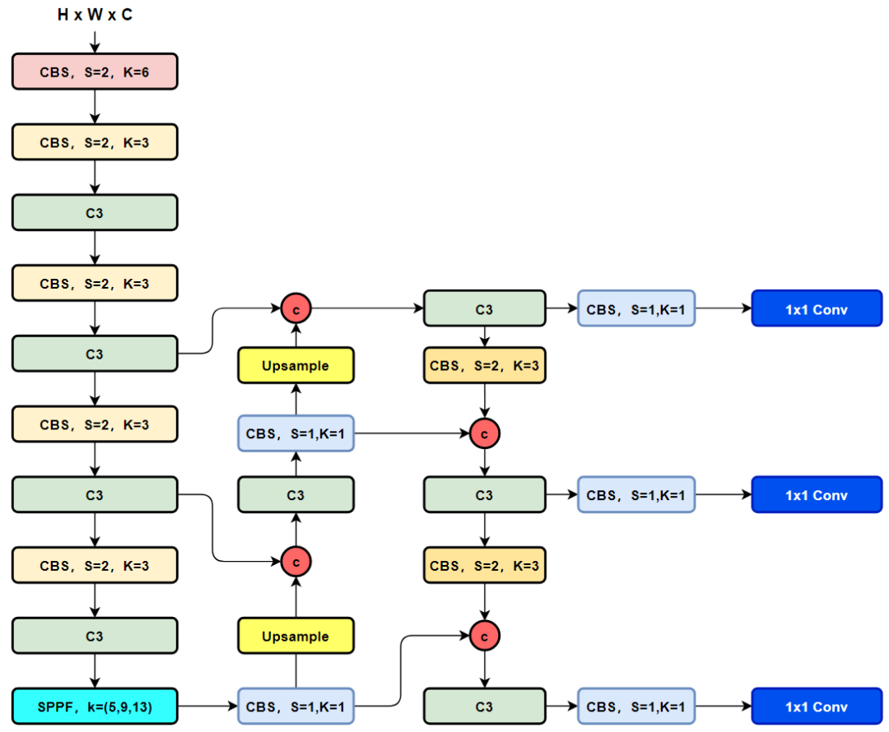


1. **Backbone**：CSPDarkNet结构，主要结构思想的体现在C3模块，这里也是梯度分流的主要思想所在的地方；
2. **PAN-FPN**：双流的FPN，必须香，也必须快，但是量化还是有些需要图优化才可以达到最优的性能，比如cat前后的scale优化等等，这里除了上采样、CBS卷积模块，最为主要的还有C3模块（记住这个C3模块哦）；
3. **Head**：Coupled Head+Anchor-base，毫无疑问，YOLOv3、YOLOv4、YOLOv5、YOLOv7都是Anchor-Base的，后面会变吗？
4. **Loss**：分类用BEC Loss，回归用CIoU Loss。

+ **YOLOv8**

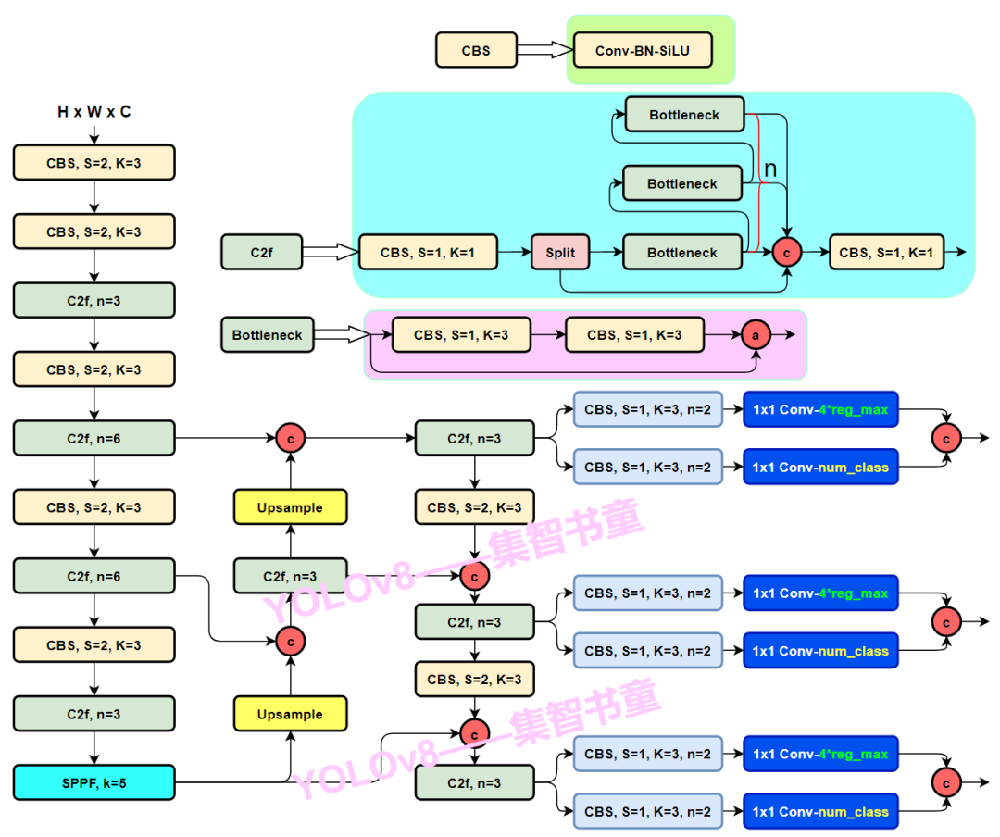

具体改进如下：

1. **Backbone**：使用的依旧是CSP的思想，不过YOLOv5中的C3模块被替换成了C2f模块，实现了进一步的轻量化，同时YOLOv8依旧使用了YOLOv5等架构中使用的SPPF模块；
2. **PAN-FPN**：毫无疑问YOLOv8依旧使用了PAN的思想，不过通过对比YOLOv5与YOLOv8的结构图可以看到，YOLOv8将YOLOv5中PAN-FPN上采样阶段中的卷积结构删除了，同时也将C3模块替换为了C2f模块；
3. **Decoupled-Head**：是不是嗅到了不一样的味道？是的，YOLOv8走向了Decoupled-Head；
4. **Anchor-Free**：YOLOv8抛弃了以往的Anchor-Base，使用了**Anchor-Free**的思想；
5. **损失函数**：YOLOv8使用VFL Loss作为分类损失，使用DFL Loss+CIOU Loss作为分类损失；
6. **样本匹配**：YOLOv8抛弃了以往的IOU匹配或者单边比例的分配方式，而是使用了Task-Aligned Assigner匹配方式。

+ **SPP Vs SPPF:**

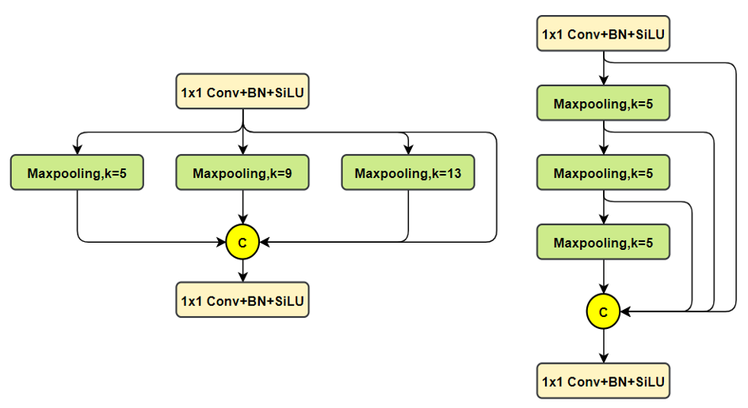

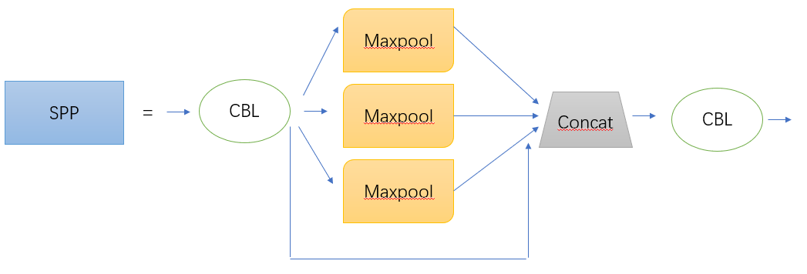

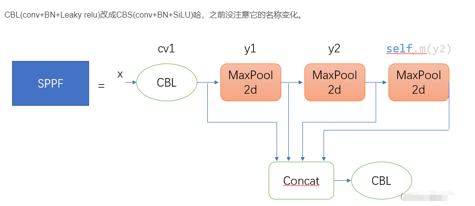

+ **C3 Vs C2f:**

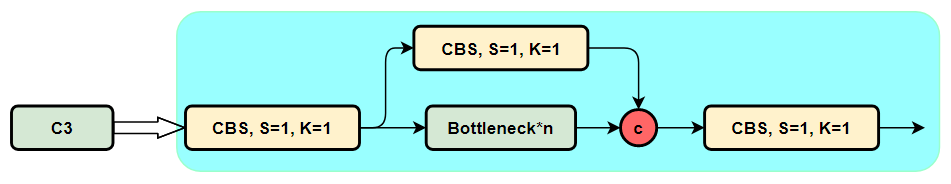


针对C3模块，其主要是借助CSPNet提取分流的思想，同时结合残差结构的思想，设计了所谓的C3 Block，这里的CSP主分支梯度模块为BottleNeck模块，也就是所谓的残差模块。同时堆叠的个数由参数n来进行控制，也就是说不同规模的模型，n的值是有变化的。

其实这里的梯度流主分支，可以是任何之前你学习过的模块，比如，美团提出的YOLOv6中就是用来重参模块RepVGGBlock来替换BottleNeck Block来作为主要的梯度流分支，而百度提出的PP-YOLOE则是使用了RepResNet-Block来替换BottleNeck Block来作为主要的梯度流分支。而YOLOv7则是使用了ELAN Block来替换BottleNeck Block来作为主要的梯度流分支。

C3模块的Pytorch的实现如下：

```python
class C3(nn.Module):
    # CSP Bottleneck with 3 convolutions
    def __init__(self, c1, c2, n=1, shortcut=True, g=1, e=0.5):  # ch_in, ch_out, number, shortcut, groups, expansion
        super().__init__()
        c_ = int(c2 * e)  # hidden channels
        self.cv1 = Conv(c1, c_, 1, 1)
        self.cv2 = Conv(c1, c_, 1, 1)
        self.cv3 = Conv(2 * c_, c2, 1)  # optional act=FReLU(c2)
        self.m = nn.Sequential(*(Bottleneck(c_, c_, shortcut, g, e=1.0) for _ in range(n)))

    def forward(self, x):
        return self.cv3(torch.cat((self.m(self.cv1(x)), self.cv2(x)), 1))
```


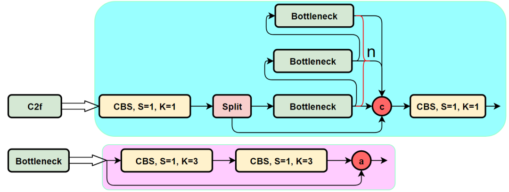


C2f模块就是参考了C3模块以及ELAN的思想进行的设计，让YOLOv8可以在保证轻量化的同时获得更加丰富的梯度流信息。

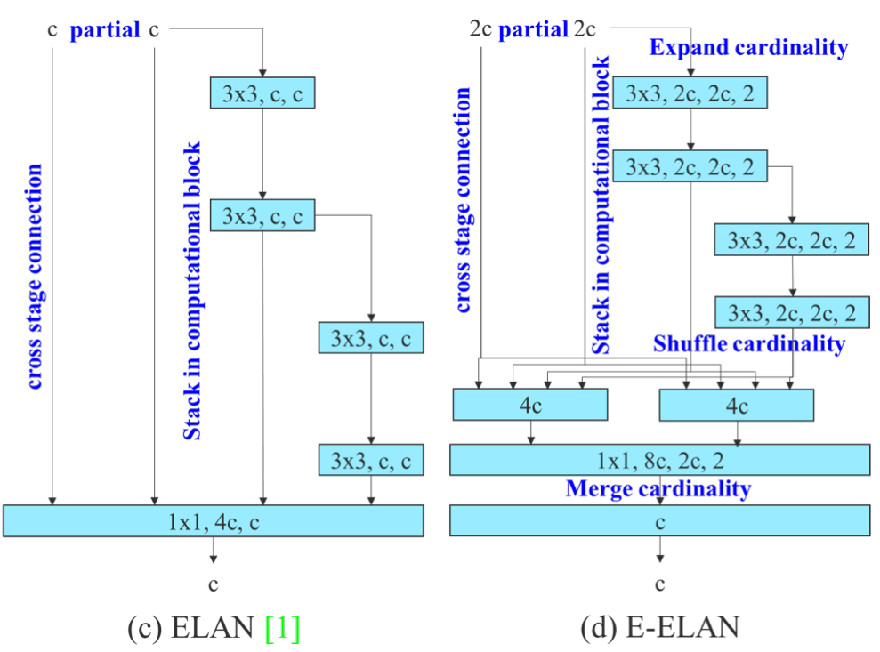

C2f模块对应的Pytorch实现如下：

```python
class C2f(nn.Module):
    # CSP Bottleneck with 2 convolutions
    def __init__(self, c1, c2, n=1, shortcut=False, g=1, e=0.5):  # ch_in, ch_out, number, shortcut, groups, expansion
        super().__init__()
        self.c = int(c2 * e)  # hidden channels
        self.cv1 = Conv(c1, 2 * self.c, 1, 1)
        self.cv2 = Conv((2 + n) * self.c, c2, 1)  # optional act=FReLU(c2)
        self.m = nn.ModuleList(Bottleneck(self.c, self.c, shortcut, g, k=((3, 3), (3, 3)), e=1.0) for _ in range(n))

    def forward(self, x):
        y = list(self.cv1(x).split((self.c, self.c), 1))
        y.extend(m(y[-1]) for m in self.m)
        return self.cv2(torch.cat(y, 1))
```

+ **PAN-FPN改进了什么？**

YOLOv5的Neck部分的结构图如下：

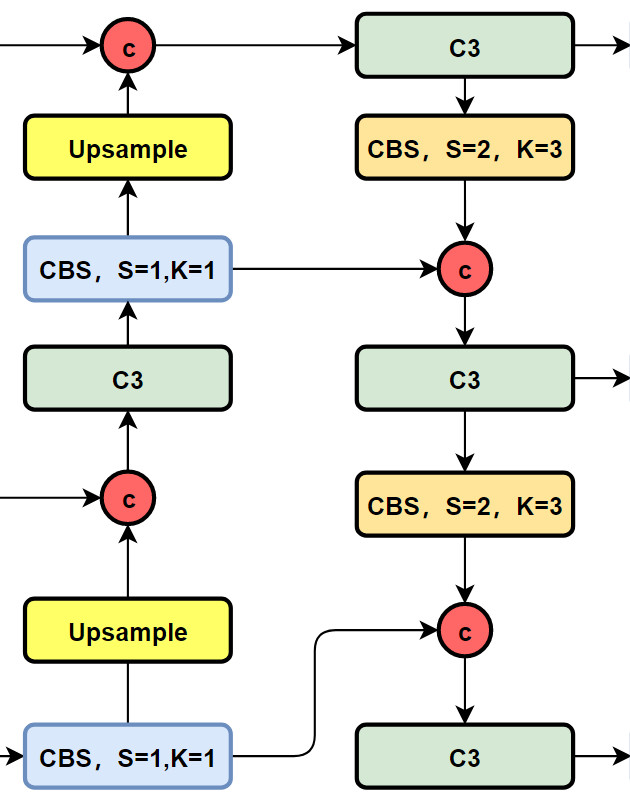

YOLOv6的Neck部分的结构图如下:

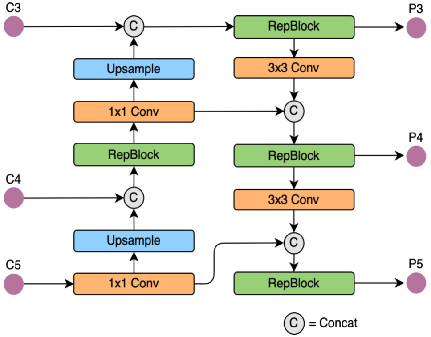

YOLOv8的结构图：

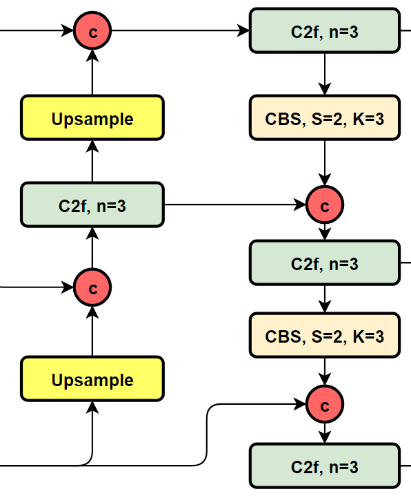

可以看到，相对于YOLOv5或者YOLOv6，YOLOv8将C3模块以及RepBlock替换为了C2f，同时细心可以发现，相对于YOLOv5和YOLOv6，YOLOv8选择将上采样之前的`1×1`卷积去除了，将Backbone不同阶段输出的特征直接送入了上采样操作。

+ **Head部分都变了什么呢？**

先看一下YOLOv5本身的Head（Coupled-Head）：

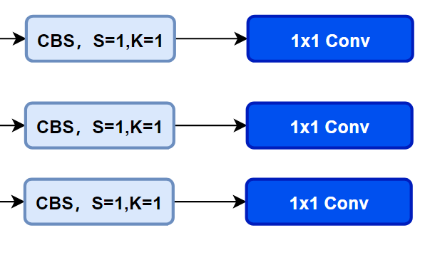

而YOLOv8则是使用了Decoupled-Head，回归头的通道数也变成了`4*reg_max`的形式：

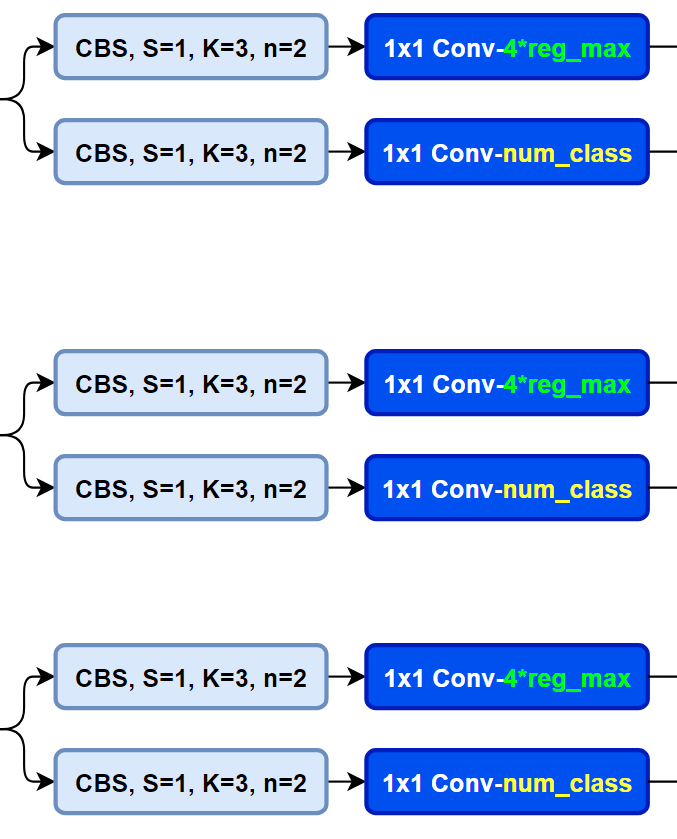

+ **损失函数**

对于YOLOv8，其分类损失为VFL Loss，其回归损失为CIOU Loss+DFL的形式，这里Reg_max默认为16。

VFL主要改进是提出了非对称的加权操作，FL和QFL都是对称的。而非对称加权的思想来源于论文PISA，该论文指出首先正负样本有不平衡问题，即使在正样本中也存在不等权问题，因为mAP的计算是主正样本。

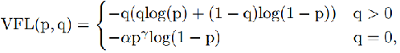


q是label，正样本时候q为bbox和gt的IoU，负样本时候q=0，当为正样本时候其实没有采用FL，而是普通的BCE，只不过多了一个自适应IoU加权，用于突出主样本。而为负样本时候就是标准的FL了。可以明显发现VFL比QFL更加简单，主要特点是正负样本非对称加权、突出正样本为主样本。

针对这里的DFL（Distribution Focal Loss），其主要是将框的位置建模成一个 general distribution，让网络快速的聚焦于和目标位置距离近的位置的分布。


+ **正负样本的匹配**

标签分配是目标检测非常重要的一环，在YOLOv5的早期版本中使用了MaxIOU作为标签分配方法。然而，在实践中发现直接使用边长比也可以达到一样的效果。而YOLOv8则是抛弃了Anchor-Base方法使用Anchor-Free方法，找到了一个替代边长比例的匹配方法: **TaskAligned**。为与NMS搭配，训练样例的Anchor分配需要满足以下两个规则：

1. 正常对齐的Anchor应当可以预测高分类得分，同时具有精确定位；
2. 不对齐的Anchor应当具有低分类得分，并在NMS阶段被抑制。

基于上述两个目标，TaskAligned设计了一个新的Anchor alignment metric 来在Anchor level 衡量Task-Alignment的水平。并且，Alignment metric 被集成在了 sample 分配和 loss function里来动态的优化每个 Anchor 的预测。

>  Anchor alignment metric：

分类得分和 IoU表示了这两个任务的预测效果，所以，TaskAligned使用分类得分和IoU的高阶组合来衡量Task-Alignment的程度。使用下列的方式来对每个实例计算Anchor-level 的对齐程度：
$$
t=s^{\alpha}+\mu^{\beta} 
$$
s 和 u 分别为分类得分和 IoU 值，α 和 β 为权重超参。从上边的公式可以看出来，t 可以同时控制分类得分和IoU 的优化来实现 Task-Alignment，可以引导网络动态的关注于高质量的Anchor。

> Training sample Assignment：

采用一种简单的分配规则选择训练样本：对每个实例，选择m个具有最大t值的Anchor作为正样本，选择其余的Anchor作为负样本。然后，通过损失函数(针对分类与定位的对齐而设计的损失函数)进行训练。

### 4.YOLOv8环境安装

我们使用的是`ultralytics(8.0.0) python package`,其安装方式如下：

```shell
#pip install -i https://test.pypi.org/simple/ --extra-index-url https://pypi.org/simple/ ultralytics==0.0.59
#pip install -e ultralytics
pip install ultralytics
```

你可以在`/usr/local/lib/pythonx.x/dist-packages/ultralytics `下找到安装装宝的YOLOv8的源文件，进行魔改！

### 5.构建自己的训练集

YOLOv8可以进行分类，检测和分割类任务的学习，我们以检测类任务为例，并训练YOLOv8s,其数据集的准备完全和YOLOv5,YOLOv6,YOLOv7的一致，可以参考我们之前的项目

+ https://github.com/DataXujing/YOLO-v5
+ https://github.com/DataXujing/YOLOv6
+ https://github.com/DataXujing/YOLOv7

### 6.构建自己训练集的配置文件和模型配置文件

+ 模型配置文件：

```yaml
#yolov8s.yaml
# Parameters
nc: 4  # number of classes
depth_multiple: 0.33  # scales module repeats
width_multiple: 0.50  # scales convolution channels

# YOLOv8.0s backbone
backbone:
  # [from, repeats, module, args]
  - [-1, 1, Conv, [64, 3, 2]]  # 0-P1/2
  - [-1, 1, Conv, [128, 3, 2]]  # 1-P2/4
  - [-1, 3, C2f, [128, True]]
  - [-1, 1, Conv, [256, 3, 2]]  # 3-P3/8
  - [-1, 6, C2f, [256, True]]
  - [-1, 1, Conv, [512, 3, 2]]  # 5-P4/16
  - [-1, 6, C2f, [512, True]]
  - [-1, 1, Conv, [1024, 3, 2]]  # 7-P5/32
  - [-1, 3, C2f, [1024, True]]
  - [-1, 1, SPPF, [1024, 5]]  # 9

# YOLOv8.0s head
head:
  - [-1, 1, nn.Upsample, [None, 2, 'nearest']]
  - [[-1, 6], 1, Concat, [1]]  # cat backbone P4
  - [-1, 3, C2f, [512]]  # 13

  - [-1, 1, nn.Upsample, [None, 2, 'nearest']]
  - [[-1, 4], 1, Concat, [1]]  # cat backbone P3
  - [-1, 3, C2f, [256]]  # 17 (P3/8-small)

  - [-1, 1, Conv, [256, 3, 2]]
  - [[-1, 12], 1, Concat, [1]]  # cat head P4
  - [-1, 3, C2f, [512]]  # 20 (P4/16-medium)

  - [-1, 1, Conv, [512, 3, 2]]
  - [[-1, 9], 1, Concat, [1]]  # cat head P5
  - [-1, 3, C2f, [1024]]  # 23 (P5/32-large)

  - [[15, 18, 21], 1, Detect, [nc]]  # Detect(P3, P4, P5)

```

+ 数据集配置文件

```yaml
#score_data.yaml

# Train/val/test sets as 1) dir: path/to/imgs, 2) file: path/to/imgs.txt, or 3) list: [path/to/imgs1, path/to/imgs2, ..]
train: ./dataset/score/images/train # train images
val: ./dataset/score/images/val # val images
#test: ./dataset/score/images/test # test images (optional)

# Classes
names:
  0: person
  1: cat
  2: dog
  3: horse

```

+ 训练超参数配置文件

我们对训练的超参数进行了简单的修改，通过命令行参数传入，也可以通过配置文件进行配置。

```yaml
task: "detect" # choices=['detect', 'segment', 'classify', 'init'] # init is a special case. Specify task to run.
mode: "train" # choices=['train', 'val', 'predict'] # mode to run task in.

# Train settings -------------------------------------------------------------------------------------------------------
model: null # i.e. yolov8n.pt, yolov8n.yaml. Path to model file
data: null # i.e. coco128.yaml. Path to data file
epochs: 100 # number of epochs to train for
patience: 50  # TODO: epochs to wait for no observable improvement for early stopping of training
batch: 16 # number of images per batch
imgsz: 640 # size of input images
save: True # save checkpoints
cache: False # True/ram, disk or False. Use cache for data loading
device: '' # cuda device, i.e. 0 or 0,1,2,3 or cpu. Device to run on
workers: 8 # number of worker threads for data loading
project: null # project name
name: null # experiment name
exist_ok: False # whether to overwrite existing experiment
pretrained: False # whether to use a pretrained model
optimizer: 'SGD' # optimizer to use, choices=['SGD', 'Adam', 'AdamW', 'RMSProp']
...
```

### 7.YOLOv8目标检测任务训练

```shell
yolo task=detect mode=train model=yolov8s.yaml  data=score_data.yaml epochs=100 batch=64 imgsz=640 pretrained=False optimizer=SGD 
```

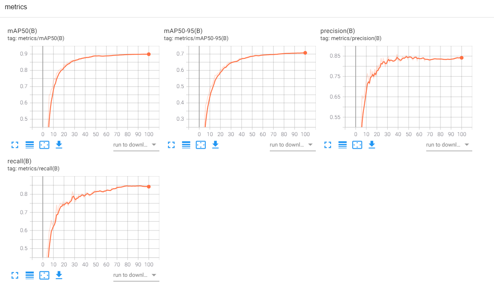

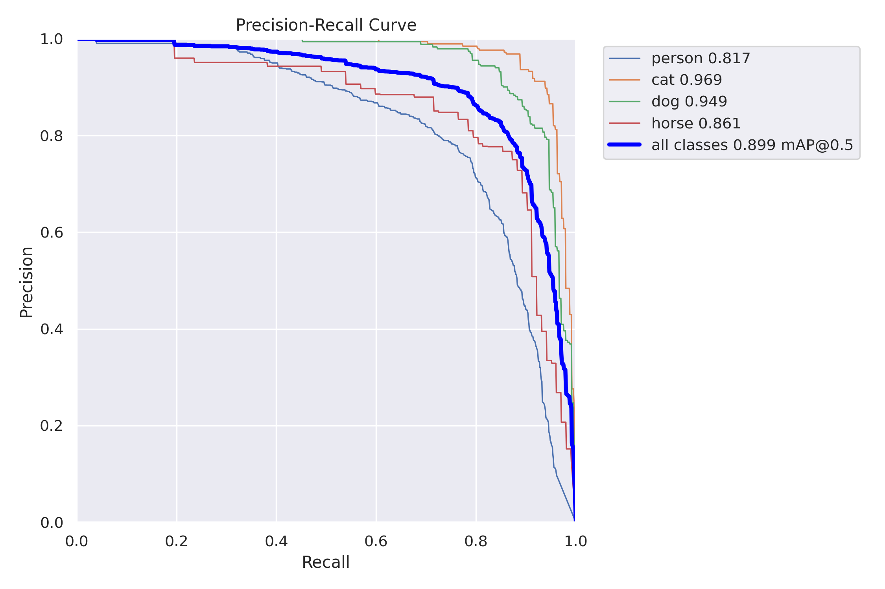

### 8.YOLOv8推断Demo

```shell
# 自己实现的推断程序
python3 inference.py
```

| 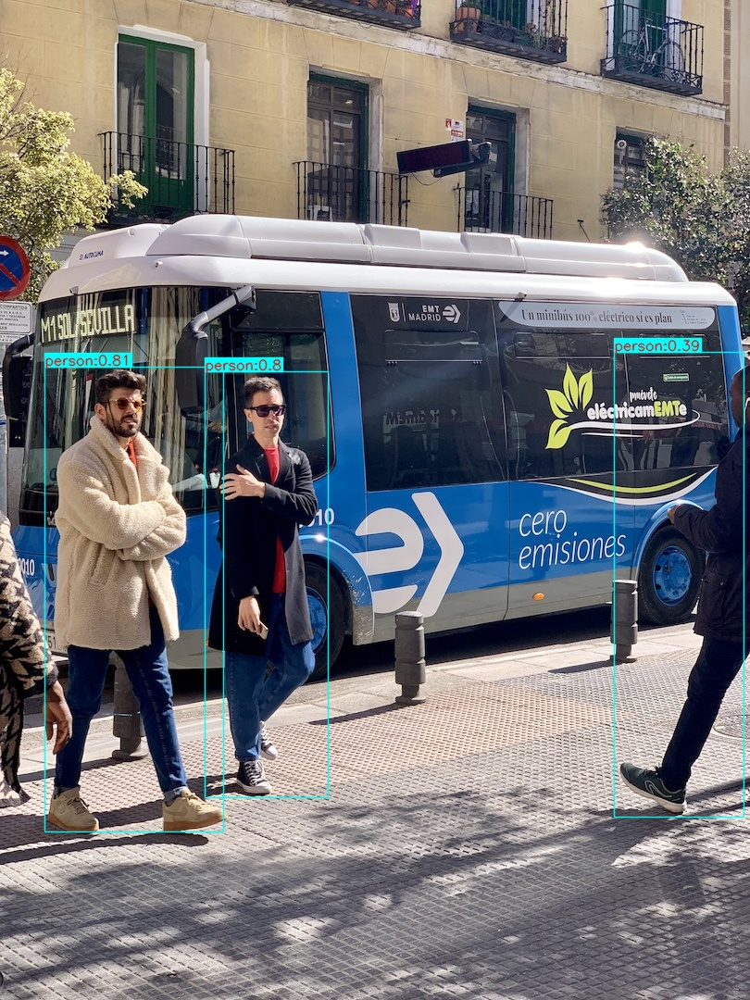  | 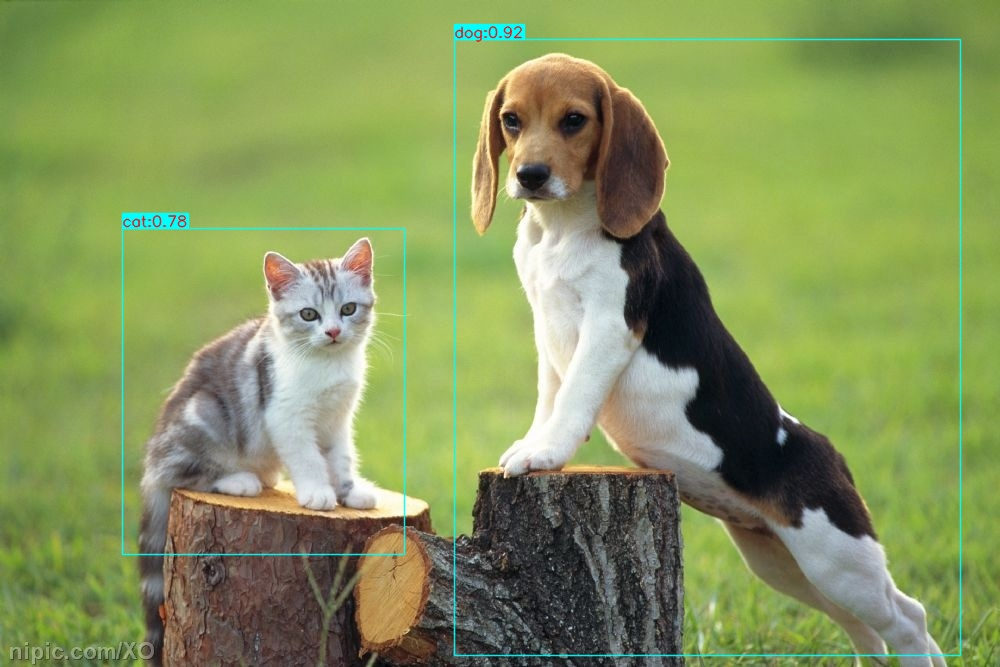   |
| ------------------ | -------------------- |
| 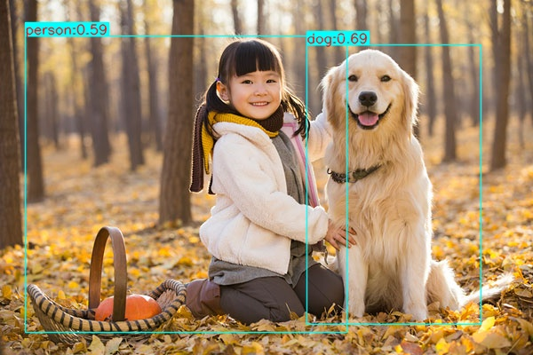 | 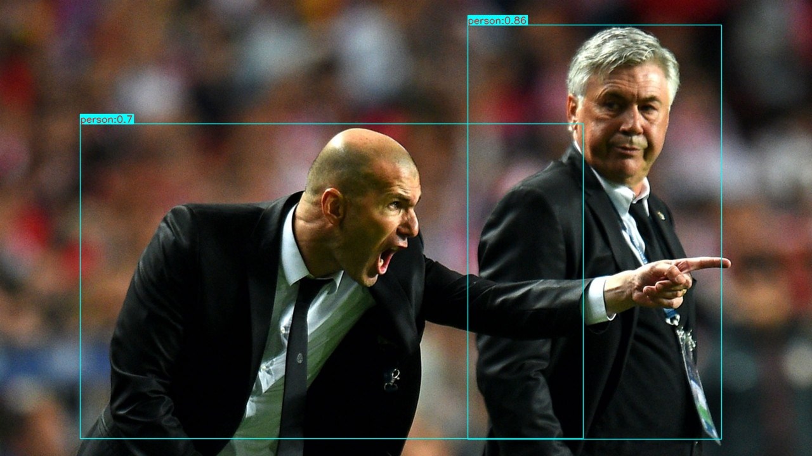 |


### 9.YOLOv8端到端模TensorRT模型加速

1. pth模型转onnx

```shell
#CLI
yolo task=detect mode=export model=./runs/detect/train/weights/last.pt format=onnx simplify=True opset=13

# python
from ultralytics import YOLO

model = YOLO("./runs/detect/train/weights/last.pt ")  # load a pretrained YOLOv8n model
model.export(format="onnx")  # export the model to ONNX format
```

2. 增加NMS Plugin 

执行`tensorrt/`下的如下代码，添加NMS到YOLOv8模型

+ 添加后处理

```shell
python3 yolov8_add_postprocess.py
```

+ 添加NMS plugin

```shell
python3 yolov8_add_nms.py
```

生成`last_1_nms.onnx`,打开该文件对比和原onnx文件的区别，发现增加了如下节点(完成了将NMS添加到onnx的目的）：

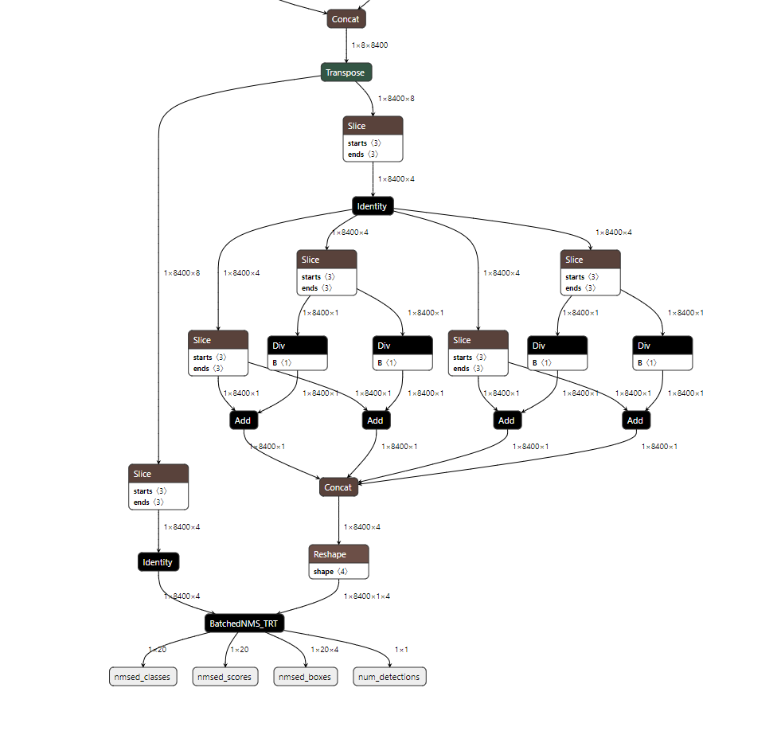

3. onnx转trt engine

```shell
trtexec --onnx=last_1_nms.onnx --saveEngine=yolov8s.plan --workspace=3000 --verbose
```

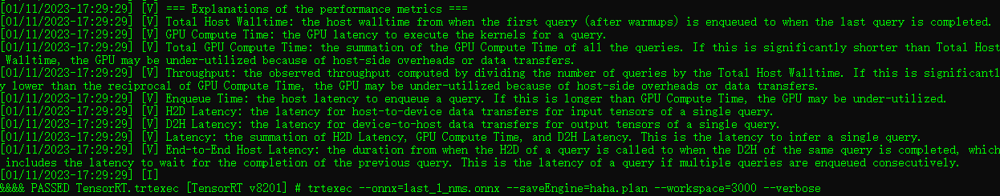

出现上述界面，onnx正常序列化为TRT engine.

4. TRT C++推断

在win 10下基于RTX 1060 TensorRT 8.2.1进行测试，我们的开发环境是VS2017,**所有C++代码已经存放在`tensorrt/`文件夹下**。其推断结果如下图所示（可以发现我们实现了YOLOv8的TensorRT端到端的推断，其推断结果与原训练框架保持一致）：

| 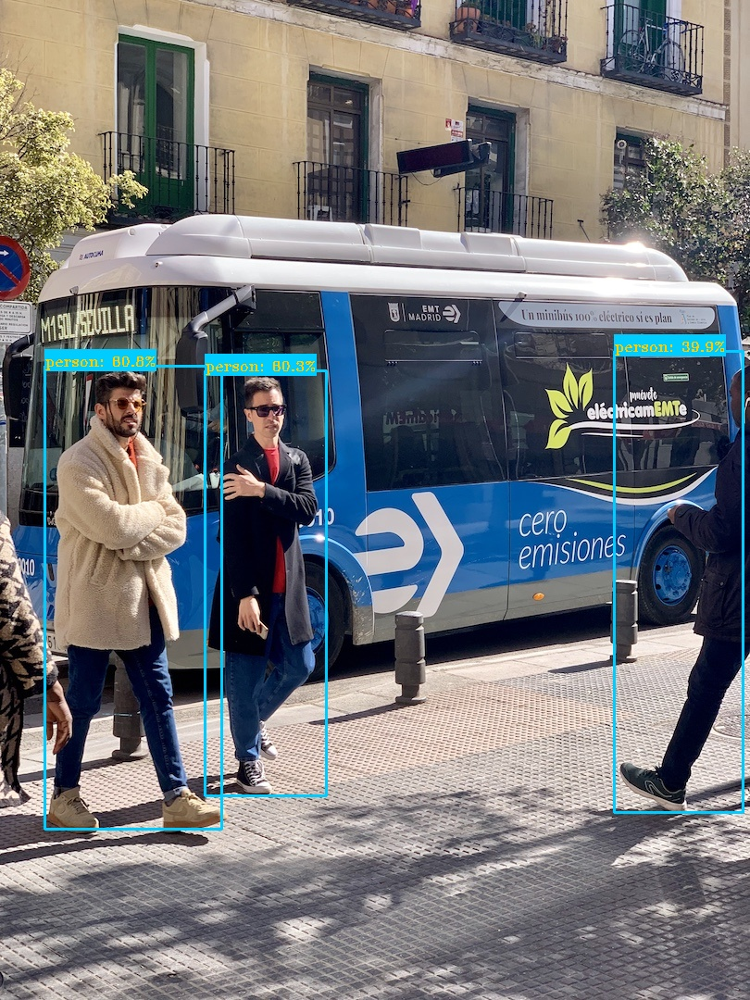  | 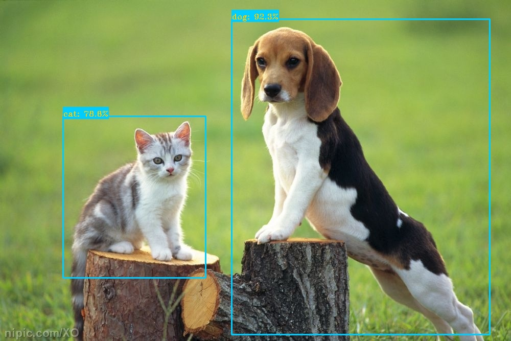   |
| ---------------------------------------- | ------------------------------------------ |
| 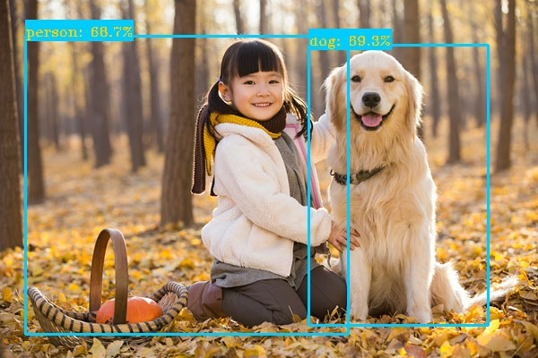 | 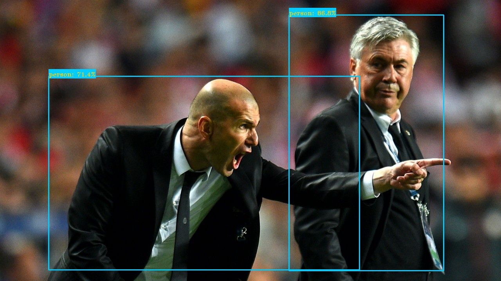 |


### 9.YOLOv8端到端华为昇腾模型推断加速

> 由于其他原因，该部分代码不开源。

这一部分我们将在华为昇腾下测试如何端到端实现YOLOv8的推断，华为昇腾目前支持的算子还是很有限的，onnx的NMS算子华为昇腾是支持的，因此我们需要将onnx的NMS算子添加到YOLOv8的onnx文件中，并将模型转化到昇腾架构下运行。这部分代码我们存放在`Ascend/`下。

1. pth转onnx

2. 增加onnx NMS算子结点

3. ATC转.om模型

4. 华为昇腾C++推断

### 10. QT + NCNN 小米手机端部署YOLOv8s

<https://github.com/DataXujing/ncnn_android_yolov8>

### 参考文献：

+ https://github.com/ultralytics/ultralytics

+ https://mp.weixin.qq.com/s/_OvSTQZlb5jKti0JnIy0tQ
+ https://github.com/ultralytics/assets/releases
+ https://v8docs.ultralytics.com/
+ https://pypi.org/project/ultralytics/0.0.44/#description
+ https://mp.weixin.qq.com/s/-4pn--3kFI_J1oX6p5GWVQ
+ https://github.com/uyolo1314/ultralytics


